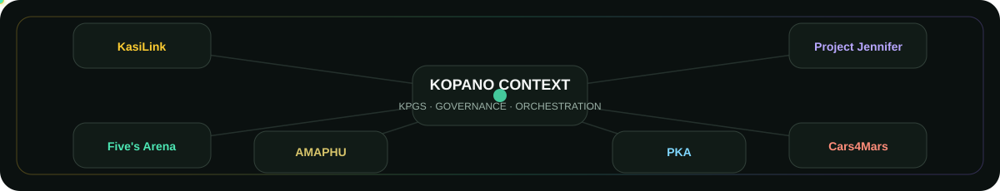

<p align="center">
  
</p>

<div align="center">
  <a href="https://www.krrababalela.com/"></a>
  <a href="https://kopanolabs.com/"></a>
  <a href="https://github.com/RobynAwesome/Project-Jennifer"></a>
  <a href="https://www.linkedin.com/in/kholofelorobynrababalela/"></a>
</div>

<p align="center">
  <strong>Founder Director & Sovereign Systems Engineer @ Kopano Labs · Cape Town 🇿🇦</strong><br/>
  <em>Building evidence-first, offline-first systems that survive contact with reality.</em>
</p>

<p align="center">
  ✝️ <strong>Jesus is King.</strong> · POC before narrative · receipts before claims · governance before drift
</p>

---

## 🧭 What I am building

My work sits where **AI orchestration, adaptive web systems, persistent state, robotics, governance and South African infrastructure constraints** meet.

The governing rule is simple:

> **If a system cannot show what changed, why it changed, what evidence supports the change, and what remains unknown, it is not ready to be treated as reality.**

The August 2026 estate target is:

```text
WORKING → CONNECTED → CURRENT → VISIBLE → EVIDENCED → BACKABLE
```

<p align="center">
  
</p>

---

## ⚡ Active systems

| System | What it proves | State |
| :--- | :--- | :---: |
| **[Kopano Context / Introduction-to-MCP](https://github.com/RobynAwesome/Introduction-to-MCP)** | MCP-driven orchestration, KPGS governance, context authority, receipts and multi-agent workflows. | `ACTIVE CORE` |
| **[KasiLink](https://kasilink.com/)** | Township-first work discovery shaped by proximity, trust, utilities and low-friction access. | `LIVE` |
| **[Five's Arena](https://fivesarena.com/)** · **[source](https://github.com/Kopano-Labs/Bookit-5s-Arena)** | Production venue, bookings, fixtures, customer flows and live arena state. | `PRODUCTION` |
| **[Project Jennifer](https://github.com/RobynAwesome/Project-Jennifer)** | A tactical RPG + governance simulator where relationship and world state persist through Memory Receipts. | `R&D → VERTICAL SLICES` |
| **[Cars4Mars](https://github.com/RobynAwesome/cars4mars-project)** | Rover safety/control, simulation, telemetry, edge perception and physical validation gates. | `DESIGN → BUILD` |
| **[AMAPHU](https://github.com/RobynAwesome/amaphu-app)** | A governed entertainment surface connecting game, manga/anime, music and interactive media. | `PHASED BUILD` |
| **Partial Knowable Algebra (PKA)** | Private bounded-uncertainty runtime: `X + Y = MAYBE`, POCvsFOC classification and recovery loops. | `PRIVATE R&D` |

---

## 🎮 Project Jennifer — the world must remember

Project Jennifer is one of the clearest visual and technical expressions of what I mean by governed intelligence:

**choice → consequence → receipt → persistence → later gameplay**

<p align="center">
  <a href="https://github.com/RobynAwesome/Project-Jennifer/tree/main/assets/Project-Waifu-Forge">
    
  </a>
  <a href="https://github.com/RobynAwesome/Project-Jennifer/tree/main/assets/Project-Waifu-Forge">
    
  </a>
</p>

<p align="center">
  <a href="https://github.com/RobynAwesome/Project-Jennifer/tree/main/assets/Project-Waifu-Forge/source">
    
  </a>
  <a href="https://github.com/RobynAwesome/Project-Jennifer">
    
  </a>
  <a href="https://github.com/RobynAwesome/Project-Jennifer/tree/main/assets/Project-Waifu-Forge/source">
    
  </a>
</p>

<p align="center"><sub>Public-lane Project Jennifer / Project Waifu Forge source assets. Visual existence is not treated as runtime canon without a separate governance receipt.</sub></p>

---

## 📡 External open-source footprint — receipts, not mythology

I keep finding my handle in public datasets I did not author. Those records are useful as **third-party discovery receipts**, but their ranks and generated lists are mutable, so I do not treat a number as a permanent identity claim.

- 🇿🇦 **[gayanvoice/top-github-users — South Africa / total contributions](https://github.com/gayanvoice/top-github-users/blob/main/markdown/total_contributions/south_africa.md)** — the generated table currently includes `RobynAwesome`; positions can change as the dataset regenerates.
- 🌍 **[xiv3r/top-github-users-ranking](https://github.com/xiv3r/top-github-users-ranking/blob/main/markdown/total_contributions/south_africa.md)** — an independent downstream ranking dataset also contains the account.
- 🤖 **[ishandutta2007/Top-AI-repos](https://github.com/ishandutta2007/Top-AI-repos/blob/main/TBI)** — `RobynAwesome` appears in the repository's `TBI` index.
- 🧠 **[tejas-ae/Top-AI-repos](https://github.com/tejas-ae/Top-AI-repos/blob/main/README.md)** — the README's public account/avatar index includes `RobynAwesome`.

<details>
<summary><strong>Why I care about this</strong></summary>
<br/>

Self-description is useful, but externally generated public records give a different kind of signal:

```text
BUILD → COMMIT → PUBLIC GRAPH → THIRD-PARTY INDEX → DISCOVERY
```

That does not prove that every ranking methodology is correct. It proves that the work leaves enough public surface area to be independently observed.

</details>

---

## 🧠 Sovereign infrastructure

<div align="center">
  
  
  
  
  
  
  
  
  
</div>

### Engineering lanes

- **Edge + experience:** Next.js, React, TypeScript 7 target, Tailwind, Adaptive PWA, Three.js.
- **Runtime:** Node.js, Python, .NET 10 / ASP.NET Core, Turborepo.
- **State:** PostgreSQL, MongoDB Atlas, append-only receipts, offline-first local state.
- **AI + orchestration:** Model Context Protocol, Kopano Context, OpenAI / ChatGPT, Codex, Gemini, Copilot, Hugging Face, Ollama, Azure AI Foundry.
- **Governance:** KPGS, PKA, POCvsFOC, CI/CD evidence gates, provenance and recovery loops.

```text
PROMPT
  ↓
PROPOSAL
  ↓
HUMAN / GOVERNANCE DECISION
  ↓
ARTIFACT
  ↓
COMMIT
  ↓
TEST + MEASUREMENT
  ↓
PASS / FAIL / UNKNOWN
```

---

## 🌐 Enter the estate

<div align="center">
  <a href="https://www.krrababalela.com/"></a>
  <a href="https://kopanolabs.com/"></a>
  <a href="https://kasilink.com/"></a>
  <a href="https://fivesarena.com/"></a>
</div>

<div align="center">
  <a href="https://github.com/RobynAwesome/Introduction-to-MCP"></a>
  <a href="https://github.com/RobynAwesome/Project-Jennifer"></a>
  <a href="https://github.com/RobynAwesome/cars4mars-project"></a>
  <a href="https://github.com/RobynAwesome/amaphu-app"></a>
</div>

<br/>

<p align="center">
  <strong>Currently:</strong> CPUT Computer Engineering Student · Johns Hopkins University Student · Robert Kennedy College<br/>
  <em>Building governed systems that turn concepts into receipts — from South Africa outward.</em><br/>
  <sub>Profile rebuilt: 24 August 2026 · visual-first · evidence-first</sub>
</p>
