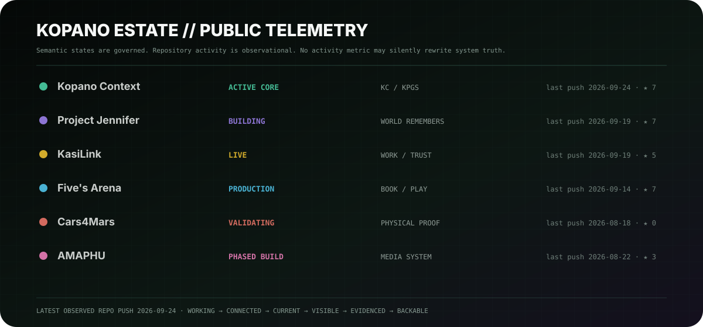

<p align="center">
  
</p>

<h1 align="center">Kholofelo “Robyn” Rababalela</h1>

<p align="center">
  <strong>Architect · Research Builder · Believer</strong><br/>
  Founder Director @ Kopano Labs · CPUT student · Cape Town, South Africa 🇿🇦
</p>

<div align="center">
  <a href="https://www.krrababalela.com/"></a>
  <a href="https://kopanolabs.com/"></a>
  <a href="https://github.com/RobynAwesome/Project-Jennifer"></a>
  <a href="https://github.com/RobynAwesome/Project-Rune"></a>
  <a href="https://www.linkedin.com/in/kholofelorobynrababalela/"></a>
</div>

<p align="center">
  ✝️ <strong>Jesus is King.</strong><br/>
  <em>I want the things I build to serve people before they impress people.</em>
</p>

<p align="center">
  
</p>

---

## 👋 Hi — I’m Robyn

I build software, AI systems, games, governance protocols, financial agents, robotics experiments and strange little research machines from Cape Town.

But the thread underneath all of it is becoming clearer:

> **How do we give intelligent systems more capability without giving up human authority, identity, accountability, memory or truth?**

I started by building applications. Then I became obsessed with what happens when software **remembers**, **acts**, **coordinates**, **changes the world**, and has to explain why it did so.

That is where most of my work lives now.

I care about people who do not have perfect infrastructure, perfect bandwidth, perfect devices, perfect credentials or time to decode a complicated interface. South African realities — unemployment, transport cost, township infrastructure, education, small business, safety and opportunity — are not “edge cases” in my work. They are design inputs.

---

## 🌱 I’ve been evolving

The current research direction is moving beyond “which AI model is smartest?”

```text
MODEL      = capability
INTERFACE  = embodiment
SEAT       = authority
IDENTITY   = accountability
GOVERNANCE = continuity
```

A model can change. A UI can change. A vendor can change.

The harder question is whether **identity, authority, context, evidence and responsibility survive the change**.

That is why I increasingly treat models as swappable capability layers rather than the owner of the system.

```text
PERSISTENCE × CONSISTENCY × CONTEXT
                ↓
       GOVERNED CONTINUITY
```

This is the research spine connecting **KPGS, Project Jennifer, RUNE, Aya, LEFA, Digital Hippocampus, PKA, MMAO/MAO and the wider Kopano Labs estate**.

---

## 🧭 Choose your door

You do **not** need to understand my architecture vocabulary to enter the work.

| If you are here to… | Start here |
| :--- | :--- |
| **Use something** | 🌍 [KasiLink](https://kasilink.com/) · ⚽ [Five’s Arena](https://fivesarena.com/) · 🎮 [Starfall Salvage](https://starfallsalvage.kopanolabs.com/) · 💸 [LEFA](https://lefa-core-live.vercel.app/) |
| **Explore a world** | 💜 [Project Jennifer](https://github.com/RobynAwesome/Project-Jennifer) · 🎨 [AMAPHU](https://github.com/RobynAwesome/amaphu-app) |
| **Build with me** | 🧠 [Kopano Context / KPGS](https://github.com/RobynAwesome/Introduction-to-MCP) · 🛡️ [Project RUNE](https://github.com/RobynAwesome/Project-Rune) · 🧰 [Agent Skills](https://github.com/RobynAwesome/Skills) |
| **Study the research** | 🧬 [Project Jennifer architecture](https://github.com/RobynAwesome/Project-Jennifer/tree/main/docs/architecture) · 🧾 [RUNE standards map](https://github.com/RobynAwesome/Project-Rune/blob/main/docs/STANDARDS_MAP.md) · 🧠 [Introduction-to-MCP](https://github.com/RobynAwesome/Introduction-to-MCP) |
| **Talk / collaborate** | 🤝 [LinkedIn](https://www.linkedin.com/in/kholofelorobynrababalela/) · 🌐 [KRRababalela.com](https://www.krrababalela.com/) |

---

## 🔥 What I’m building now

| System | What I’m testing | Current public truth |
| :--- | :--- | :---: |
| **[Kopano Context / KPGS](https://github.com/RobynAwesome/Introduction-to-MCP)** | Persistent context, authority, orchestration, receipts, POCvsFOC and multi-agent governance. | `ACTIVE CORE` |
| **[Project Jennifer](https://github.com/RobynAwesome/Project-Jennifer)** | Can relationship, world state and consequence become persistent, playable and auditable? | `PLAYABLE LOVE LOOP · R&D` |
| **[Project RUNE](https://github.com/RobynAwesome/Project-Rune)** | Can agent↔agent coordination and identity claims require independent endorsement instead of assumed-safe consensus? | `REFERENCE MVP` |
| **[LEFA-AI](https://github.com/RobynAwesome/lefa-ai)** | Governed financial intelligence with bounded execution, zero-trust controls, receipts and evidence-backed agent chains. | `GOVERNED POC VALIDATED` |
| **[Ayakha / Aya](https://github.com/RobynAwesome/ayakha-ai)** | A local-first multimodal design companion that can help a learner move from intent → brief → approved Canva / SolidWorks change. | `MVP TRUTH-LOCKED` |
| **[Cars4Mars](https://github.com/RobynAwesome/cars4mars-project)** | Rover safety, telemetry, simulation, edge perception and physical validation. | `DESIGN → BUILD` |
| **[KasiLink](https://kasilink.com/)** | Township-first work discovery where distance, trust and infrastructure are product logic. | `LIVE` |
| **[Five’s Arena](https://fivesarena.com/)** | Real venue operations, booking truth, adaptive UX and resilient mobile flows. | `PRODUCTION` |
| **[AMAPHU](https://github.com/RobynAwesome/amaphu-app)** | Governed entertainment across interactive media, game, music and visual worlds. | `PHASED BUILD` |

<p align="center">
  
</p>

<p align="center"><sub>The telemetry card tracks a selected core product estate. The research radar above is intentionally broader.</sub></p>

---

# 🎮 Project Jennifer — the world remembers what you choose

Project Jennifer has evolved hard.

It is now centered on **Jennifer City: a web-first companion-consequence RPG about relationships, memory and governed intelligence**. Tactical combat remains a long-term direction; the present product proof is a loved continuity loop.

```text
CHOICE
  ↓
CONSEQUENCE
  ↓
RECEIPT
  ↓
PERSISTENCE
  ↓
THE NEXT SCENE REMEMBERS
```

<p align="center">
  <a href="https://github.com/RobynAwesome/Project-Jennifer">
    
  </a>
</p>

<p align="center">
  <a href="https://github.com/RobynAwesome/Project-Jennifer">
    
  </a>
  <a href="https://github.com/RobynAwesome/Project-Jennifer/blob/main/docs/architecture/memory-receipt-risk-matrix.md">
    
  </a>
</p>

<p align="center">
  <a href="https://github.com/RobynAwesome/Project-Jennifer/tree/main/assets/Project%20Companions">
    
  </a>
</p>

The current repository proof now includes a **CI-gated love loop**, playable Memory District / Telemetry Tower work, a Third Signal episode, local-first continuity, epistemic disagreement, and a same-browser Continue path designed to survive API failure.

That matters to me because I do not want AI characters that only *sound* like they remember you. I want the system to distinguish story, memory, inference, authority and evidence.

<div align="center">
  <a href="https://github.com/RobynAwesome/Project-Jennifer"></a>
  <a href="https://github.com/RobynAwesome/Project-Jennifer/blob/main/docs/architecture/memory-receipt-risk-matrix.md"></a>
</div>

---

# 🛡️ Project RUNE — endorsement, not consensus

<p align="center">
  <a href="https://github.com/RobynAwesome/Project-Rune">
    
  </a>
</p>

**RUNE — Runtime Unified Network Endorsement** is my current public research product for a very specific problem:

> **Multi-agent coordination is not the same thing as verified safety.**

RUNE treats agent coordination events and identity claims as things that can be independently endorsed, rejected, revoked and receipted — rather than trusting agreement because several agents voted the same way.

The public repo is intentionally honest about status: **reference MVP, scaffold + fail-closed gate**. It is not marked complete, proven or demo-ready without owner verification receipts.

```text
MCP  → agent ↔ software tools
MHS  → agent ↔ physical hardware
RUNE → agent ↔ agent coordination / identity claims
KPGS → wider governance authority + continuity
```

<div align="center">
  <a href="https://github.com/RobynAwesome/Project-Rune"></a>
  <a href="https://github.com/RobynAwesome/Project-Rune/blob/main/docs/THREAT_MODEL.md"></a>
</div>

---

## 🤝 Companion systems: Aya + LEFA

The more I build, the more I care about **heavy architecture disappearing behind a humane interface**.

### 🎨 Ayakha / Aya

[Aya](https://github.com/RobynAwesome/ayakha-ai) is a local-first multimodal design-thinking desktop companion for students and makers.

The MVP is deliberately narrow: speak, type, sketch or show an intention → clarify missing requirements → create an explainable brief → make **one approved Canva change and one approved SolidWorks change**.

The point is not “AI does CAD for you.” The point is a learner staying in control while the system helps them think, make and understand.

### 💸 LEFA

<p align="center">
  <a href="https://github.com/RobynAwesome/lefa-ai">
    
  </a>
</p>

[LEFA](https://github.com/RobynAwesome/lefa-ai) asks a similar question in finance:

> **Can one human-facing intelligence receive messy intent, use governed internal agents and real financial evidence, preserve uncertainty, and make a decision that time can later validate?**

Its current lane includes zero-trust middleware, bounded paper-execution authority, evidence-backed chains, ADK work, risk gates and receipts. **Live trading is not silently promoted from a demo.**

---

## 🧠 The research map underneath the products

A lot of my repositories are separate products, but the research is converging.

```text
HUMAN INTENT
    ↓
IDENTITY ── who is acting?
    ↓
SEAT ────── what authority do they hold?
    ↓
CONTEXT ─── what should persist?
    ↓
GOVERNANCE ─ what may change?
    ↓
EVIDENCE ─── what proves it?
    ↓
RECEIPT ──── what survives the session?
    ↓
ACTION / WORLD CHANGE
    ↺
```

Current research lanes include:

- **KPGS / GSMB** — governance continuity across stateless model sessions.
- **Digital Hippocampus** — persistent context, provenance and memory architecture.
- **PKA / POCvsFOC** — bounded uncertainty and an immune system for false closure.
- **MMAO / MAO** — multi-agent orchestration with human authority held outside agent consensus.
- **RUNE** — independently endorsed coordination and identity claims.
- **Memory Receipts** — making consequence inspectable in Project Jennifer.
- **Source Authority** — relevance is not the same as permission, canon or truth.
- **Zero-trust agent systems** — fail closed, minimize authority, preserve evidence.
- **MCP / WebMCP / ADK / portable skills** — reusable interfaces for agents without surrendering governance to one vendor.
- **Embodied and spatial computing** — Three.js, Blender, robotics, voice interfaces and physical-tool control.

<details>
<summary><strong>OPEN // The doctrine I keep returning to</strong></summary>
<br/>

```text
POC BEFORE NARRATIVE
RECEIPTS BEFORE CLAIMS
SOURCE AUTHORITY BEFORE RETRIEVAL CONFIDENCE
GOVERNANCE BEFORE DRIFT
UNKNOWN IS A VALID STATE
FAILURE MUST LEAVE A RECEIPT
MODEL CAPABILITY DOES NOT EQUAL SYSTEM AUTHORITY
CONSENSUS DOES NOT EQUAL ENDORSEMENT
```

The point is not bureaucracy.

The point is to let systems become more powerful **without becoming less inspectable, less accountable or less human**.

</details>

---

## 🇿🇦 Why I care

I am building from South Africa, not from an abstract “ideal user” diagram.

I think about:

- the student with an idea but no expensive workstation;
- the graduate with skills but no clear opportunity path;
- the township business that cannot afford wasted transport or data;
- the founder who needs software to tell the truth when a provider is down;
- the designer who wants AI help without surrendering authorship;
- the person using financial intelligence who deserves boundaries, not magic language;
- the developer who needs to inspect what the agent actually did.

That is why I keep coming back to **offline-first, low-data, local-first, governed, reversible and evidence-backed systems**.

Technology should increase agency.

---

## 🧰 What I build with

<div align="center">
  
  
  
  
  
  
  
  
  
  
</div>

I use OpenAI, Anthropic, Google, Microsoft, AWS, Hugging Face and open-source models/tools where they fit.

**I do not want vendor lock to become architecture.** The model is a capability provider; the system still needs its own identity, authority, memory and governance.

---

## 🎓 Also: I’m still learning

I am still a student while building all of this.

Some days I am writing governance protocols. Some days I am debugging a rover. Some days I am learning Blender from the beginning, studying algorithms, reading about Fourier optics and holography, or trying to understand why a CI gate exploded at 20:00 on a Sunday. 😭

I like that tension.

I do not want to become the kind of builder who can explain a system beautifully but has stopped being teachable.

---

## 🌐 Live estate

<div align="center">
  <a href="https://www.krrababalela.com/"></a>
  <a href="https://kopanolabs.com/"></a>
  <a href="https://kasilink.com/"></a>
  <a href="https://fivesarena.com/"></a>
  <a href="https://starfallsalvage.kopanolabs.com/"></a>
</div>

---

## 🤝 Come say hi

If you are a **student, researcher, founder, designer, developer, investor, community builder or simply curious human**, you do not need the perfect introduction.

If something here makes you think *“wait… what are you doing over there?”* — that is a good enough reason to talk. 🙂

<div align="center">
  <a href="https://www.linkedin.com/in/kholofelorobynrababalela/"></a>
  <a href="https://github.com/RobynAwesome"></a>
</div>

<p align="center">
  <br/>
  <strong>Build for people. Tell the truth. Leave receipts.</strong><br/>
  <em>From Cape Town outward.</em><br/>
  <sub>Living profile · major evolution: September 2026</sub>
</p>
